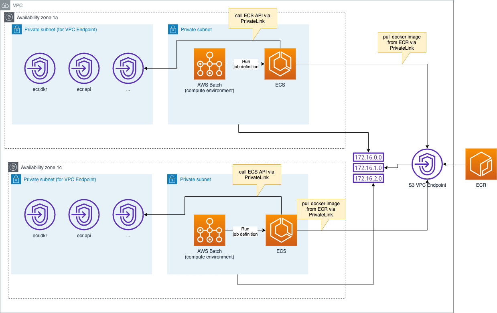

# AWS Batch Terraform Sample
This is a sample Terraform to build AWS Batch resource. In this Terraform resource, AWS Batch accesses ECS endpoint and ECR endpoint via PrivateLink.

Structure is like this.
